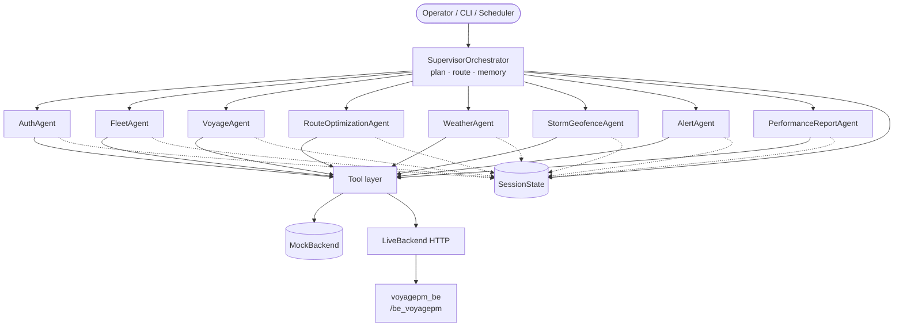
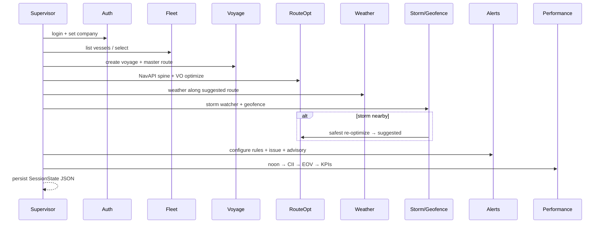

# VoyagePM Agentic Framework

Multi-agent automation of everything the [voyagepm_be](../voyagepm_be) backend does today — auth/tenancy, fleet, voyages, route optimization, weather, storms/geofence, alerts, and performance reporting (CII/EOV).

**Location:** `/home/gunish/Projects/voyagepm_agentic_framework` (sibling of `voyagepm_be`, not inside it).

## Why this is an agentic framework

| Agentic property | How it appears here |
|------------------|---------------------|
| **Goal-directed** | Named workflows *or* free-form goals (`--goal "avoid the typhoon…"`) |
| **Multi-agent** | 8 specialists + 1 supervisor, each with a clear domain |
| **Tool use** | Agents never talk to Postgres directly — they call VoyagePM tools (mock or live REST) |
| **Planning** | Supervisor decomposes goals → ordered agent plan (rules today; optional LLM) |
| **Shared memory** | `SessionState` carries tenant, voyage, routes, weather, alerts, KPIs across steps |
| **Feedback loops** | Weather/storm findings feed re-optimization and alert/advisory issuance |
| **Autonomy** | One command runs an end-to-end lifecycle without a human clicking the FE |

Deterministic specialists (no LLM required for the happy path). Optional `OPENAI_API_KEY` upgrades free-form goal planning.

## Quick start

```bash
cd /home/gunish/Projects/voyagepm_agentic_framework
python3 -m venv .venv && source .venv/bin/activate
pip install -r requirements.txt
cp .env.example .env

python3 scripts/selfcheck.py
python3 scripts/run_demo.py
python3 scripts/run_cli.py --list
python3 scripts/run_cli.py --workflow full_voyage_lifecycle
python3 scripts/run_cli.py --goal "re-route around the storm and alert the fleet"

# Continuous ops (inbox Excel + storm poller)
# Fill VPM_INBOX_DIR / VPM_STORM_OUT_DIR / VPM_REPORTS_OUT_DIR / VPM_TEMPLATES_DIR in .env
python3 scripts/run_daemon.py --once          # one cycle
python3 scripts/run_daemon.py                 # always-on loop (all pollers in one process)

# Docker microservices (preferred for ops — each loop in its own container)
docker compose up --build
# Scale the slow one independently:
# docker compose up --scale routeopt=4
```

Shared state across containers is the voyage registry JSON, drop folders, and `VPM_JOBS_DIR` (file job bus). They do not wait on each other.

| Container | Agent | Waits on |
|-----------|--------|----------|
| `ingest` | InboxWatch + PreVoyageIngest | inbox folder |
| `noon` | NoonExcelWatch + NoonOps + EOV | noon folder + registry |
| `weather` | WeatherReport | registry `weather_due_at` |
| `routeopt` | PreVoyageRouteOptimize | job files from ingest/noon |
| `storm` | StormWatch | timer (writes snapshots others read) |
| `port-weather` | PortWeather | registry arrival/departure + 24h timer |
| `report-sender` | report_sender | PDF folders + optional DBs |

Do not run `run_daemon.py` and Compose at the same time — they would double-pick inbox files.

**Folder layout:** each drop/output root uses `incoming/` (new work) and `sent/` (done / emailed). Drop pre-voyage and noon files in `{inbox}/incoming/`, not the root.

`VPM_MODE=mock` (default) runs fully offline against an in-memory backend that mirrors `voyagepm_be` APIs. Set `VPM_MODE=live` + `VPM_BASE_URL` to drive a real backend.

## Agent → VoyagePM flow map

| Agent | VoyagePM BE surface | What it automates |
|-------|---------------------|-------------------|
| **AuthAgent** | `/login`, `/setCompany`, domain→company mapping | Tenant resolution, session |
| **FleetAgent** | `/vessels/client`, `/fleet` | Pick working vessel / positions |
| **VoyageAgent** | `/voyages`, master/temp/suggested routes | Open voyage, persist routes |
| **RouteOptimizationAgent** | NavAPI `/calc/SingleRoute`, ChartWorld, VO `/voyage-optimization/optimize/*`, `/route-optimization/ro-*` | Spine + shortest/fuel/fastest/safest; publish suggested |
| **WeatherAgent** | `/weather/route`, VO weather point APIs | Route weather + hard-region flags |
| **StormGeofenceAgent** | `/storm-pipeline/*`, `/geofence-check`, `/geofence-optimizer/run` | JTWC storms, proximity, storm re-optimize |
| **AlertAgent** | `/alerts`, schedulers, `/advisories` | Rule setup, evaluation, operator advisory |
| **PerformanceReportAgent** | `/noonReports`, `/cii/*`, EOV, `/voyage-performance` | Noon ingest → CII/EOV/KPIs |

**SupervisorOrchestrator** is the control plane: selects a plan, runs agents in order, writes `data/*.json`.

## Named workflows

| Workflow | Plan |
|----------|------|
| `full_voyage_lifecycle` | Auth → Fleet → Voyage → Optimize → Weather → Storm → Alert → Performance |
| `optimize_and_publish` | Auth → Fleet → Voyage → Weather → Optimize → Alert |
| `storm_response` | Auth → Fleet → Voyage → Storm → Weather → Optimize → Alert |
| `daily_monitoring` | Auth → Fleet → Voyage → Weather → Storm → Alert |
| `performance_closeout` | Auth → Fleet → Voyage → Performance |

## Architecture

See [docs/ARCHITECTURE.md](docs/ARCHITECTURE.md) for the full diagram and design notes.



### Typical full lifecycle



## Project layout

```
voyagepm_agentic_framework/
├── vpm_agents/
│   ├── config.py
│   ├── core/           # state, base Agent/Tool, LLM, orchestrator
│   ├── agents/
│   │   ├── specialists.py
│   │   └── specs/      # one .md per agent — task brief + Defaults JSON
│   ├── tools/          # MockBackend + LiveBackend
│   └── workflows/      # thin named-workflow helpers
├── scripts/            # run_demo, run_cli, selfcheck
├── docs/ARCHITECTURE.md
├── data/               # run outputs
└── requirements.txt
```

## Agent behavior specs (Markdown)

Each agent (and the supervisor) has a Markdown file under `vpm_agents/agents/specs/`.
Edit the MD to manage tasks and knobs:

| Section | Purpose |
|---------|---------|
| Role / Objective / Tasks | Human (and future LLM) brief — how the agent should behave |
| Defaults ` ```json ` | Machine knobs `run()` actually reads (objectives, ports, alert rules, workflows…) |

Copy `_TEMPLATE.md` to add a new agent. Supervisor workflows + goal keywords live in `SupervisorOrchestrator.md`.

## Expected bad weather — dates & reasons

When thresholds are exceeded (`weather_limits` in `WeatherReportAgent.md` Defaults), events list **date/time**, **position**, and **reason**.

Voyage reports now share one tree per vessel/voyage:
`VPM_REPORTS_OUT_DIR/{vessel_imo}/{voyage_number}/`

- `pre_voyage_report/`
- `weather_report/`
- `port_weather/`
- `end_of_voyage_report/`
- `vpa/`

Port-weather folder loop (separate microservice):

- Trigger: latest **Arrival Report** for a vessel starts in-port weather refresh
- Cadence: every `VPM_PORT_WEATHER_INTERVAL_HOURS` (default 24h)
- Stop: a newer **Departure Report** for the same vessel halts refresh
- Output: `VPM_REPORTS_OUT_DIR/{imo}/{voyage}/port_weather/incoming/port_weather_*.pdf` (picked by report-sender)

`scripts/run_daemon.py` always-on loop:

| Trigger | Agent | Output |
|---------|-------|--------|
| New pre-voyage Excel/CSV in `VPM_INBOX_DIR` | `PreVoyageIngestAgent` | master route + 6h waypoints + report under `VPM_REPORTS_OUT_DIR` |
| New noon Excel/CSV (same `voyage_number`) | `NoonOpsAgent` | 7-day 6h plan from noon lat/lon + templated report |
| Every `VPM_STORM_INTERVAL_HOURS` (default 6) | `StormWatchAgent` | JSON/txt snapshots in `VPM_STORM_OUT_DIR` (no voyage required) |

Templates live in `VPM_TEMPLATES_DIR` (default `templates/`). Drop your report formats there later; placeholders use `{name}` str.format fields.

Sample inbox files: `samples/inbox/pre_voyage.csv`, `samples/inbox/noon_report.csv`.

## Relation to existing `voyage_Agentic_ai`

`voyage_Agentic_ai` is a focused **weather-alert pipeline** (Excel ingest → 6h waypoints → Spire stub → hard regions → email). This project is the **full VoyagePM product automation layer**: every major BE capability area as an agent, with workflows that compose them. They can coexist; weather-specific email templates can later plug into `AlertAgent` / `WeatherAgent` tools.
