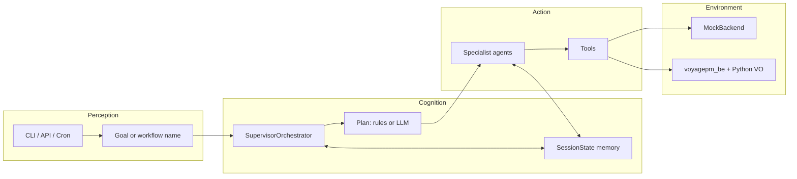

# Architecture — VoyagePM Agentic Framework

## 1. Design intent

`voyagepm_be` is a multi-tenant Express API: auth, vessels, voyages, NavAPI/ChartWorld/Python VO, Spire/NOAA weather, JTWC storms, geofence optimizer, alerts, noon/CII/EOV. Humans drive that surface through the FE.

This framework turns those **capability areas into agents** and those **user journeys into workflows**, so an operator (or cron) can state a goal and the system executes the chain autonomously.

## 2. Layered view

## 3. Agents and BE mapping

| # | Agent | Primary BE routes / jobs |
|---|-------|--------------------------|
| 0 | SupervisorOrchestrator | — (planner/router) |
| 1 | AuthAgent | `POST /login`, `POST /setCompany`, user-company-mapping |
| 2 | FleetAgent | `GET /vessels/client`, `GET /fleet` |
| 3 | VoyageAgent | `CRUD /voyages`, temp/master/suggested routes |
| 4 | RouteOptimizationAgent | `/calc/SingleRoute`, `/routeCreation`, VO optimize/estimate/evaluate, ro-safest/fastest/lowest-fuel |
| 5 | WeatherAgent | `/weather/*`, VO weather point/batch, NOAA/Spire |
| 6 | StormGeofenceAgent | storm pipeline jobs, `/geofence-check`, `/geofence-optimizer/run` |
| 7 | AlertAgent | `/alerts`, schedulers, `/advisories`, socket/email side-effects in live mode |
| 8 | PerformanceReportAgent | `/noonReports`, `/cii/*`, EOV, `/voyage-performance`, savings |

## 4. Workflow catalogue

## 5. Control loop (why it is agentic)

1. **Perceive** — workflow name or natural-language goal  
2. **Plan** — Supervisor picks ordered specialists (`resolve_goal`)  
3. **Act** — each agent invokes tools against mock/live BE  
4. **Observe** — results written into `SessionState`  
5. **Adapt** — later agents branch on state (e.g. geofence hits → safest re-optimize → advisory)  
6. **Persist** — JSON artifact under `data/` for audit / next cycle  

That perceive→plan→act→observe loop with tool-using specialists is the agentic core. It is **not** a single LLM chatbot wrapping the API; it is a **multi-agent control plane** over the same domain operations as `voyagepm_be`.

## 6. Mock vs live

| Mode | Class | Use |
|------|-------|-----|
| `VPM_MODE=mock` | `MockBackend` | Offline demos, CI selfcheck, no DB |
| `VPM_MODE=live` | `LiveBackend` | Cookie-auth HTTP to `/be_voyagepm` |

Both expose the same method surface so agents stay mode-agnostic.

## 7. Agent specs (Markdown source of truth)

Behavior for each specialist + the supervisor lives in `vpm_agents/agents/specs/{Name}.md`.

- **Role / Objective / Tasks / Failure** — what the agent is supposed to do (edit these when iterating on the job).
- **Defaults JSON fence** — knobs loaded at init (`objectives`, alert `rules`, voyage ports, supervisor `workflows` / `goal_hints`).

`Agent` loads its spec in `__init__`; `SupervisorOrchestrator` loads workflows from `SupervisorOrchestrator.md`. Prefer editing the MD over hardcoding constants in Python.

## 8. Continuous folder ops

`scripts/run_daemon.py` is the always-on control loop:

1. Poll `VPM_INBOX_DIR` for pre-voyage / noon Excel (or CSV)
2. `PreVoyageIngestAgent` → master + 6h waypoints + report
3. `NoonOpsAgent` → 7-day 6h plan from noon lat/lon + templated report
4. Independently every `VPM_STORM_INTERVAL_HOURS`, `StormWatchAgent` writes storm snapshots to `VPM_STORM_OUT_DIR`

Templates: `VPM_TEMPLATES_DIR`. Registry: `VPM_REGISTRY_PATH`.

## 9. Extension points (keep them thin)

- Swap Spire/NOAA real clients into `WeatherAgent` tools  
- Fork Python VO CLIs from `voyagepm_be/services/*` as local tools when BE is unavailable  
- Plug IMAP/SMTP like `voyage_Agentic_ai` into `AlertAgent`  
- Add a thin FastAPI façade that accepts goals and returns `SessionState`  
- Turn Supervisor into LangGraph nodes only if complexity forces it — current orchestrator is intentional YAGNI
- Replace placeholder weather block in noon reports when Spire/NOAA tools are wired
- Drop real Excel column layouts into inbox parsers when ops provides the final sheet format
