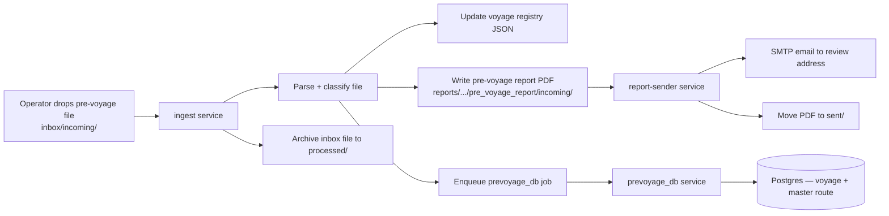

# Demo Flow: Ingestion → Database → Report Email

## Purpose

This document describes the **current demo-ready flow** for showing how operational files are ingested, persisted, and emailed as reports.

**Out of scope for this demo:** weather polling, passage weather reports, route optimization, storm monitoring, port weather.

---

## What Management Should See

The system already supports an end-to-end loop:

1. A pre-voyage file is dropped into the inbox.
2. The ingest service picks it up automatically.
3. Voyage data is written to the local registry and (optionally) Postgres.
4. A PDF report is generated.
5. The report-sender service emails that PDF and archives it.

This is a working ingestion + delivery pipeline. It does not require weather or route optimization services to be running.

---

## Minimal Demo Architecture



---

## Services to Run (Demo Only)

| Service | Required | Role |
|---------|----------|------|
| `ingest` | Yes | Watches inbox, parses pre-voyage files, writes registry + report PDF |
| `report-sender` | Yes | Watches report folders, emails PDFs, moves to `sent/` |
| `prevoyage_db` | Optional | Writes ingested voyage data to tenant Postgres |

**Do not start for this demo:** `weather`, `routeopt`, `storm`, `port-weather`

### Docker Compose (recommended)

```bash
# From project root — only the demo path
docker compose up --build ingest report-sender prevoyage-db
```

If you skip database persistence in the demo, you can run just:

```bash
docker compose up --build ingest report-sender
```

---

## Recommended Demo Configuration

In `.env`:

```bash
VPM_DAEMON_FLOW=noon_monitoring
VPM_WEATHER_REPORT_ON_NOON=false
VPM_WEATHER_REPORT_ON_PREVOYAGE=false
VPM_REPORT_SENDER_FOLDER=true
VPM_REPORT_SENDER_REVIEW_EMAIL=your-review@company.com
VPM_SMTP_HOST=...
VPM_SMTP_PORT=587
VPM_SMTP_USER=...
VPM_SMTP_PASSWORD=...
VPM_SMTP_FROM=...
```

`noon_monitoring` means pre-voyage ingest runs, but the one-shot chain stops before weather or route optimization.

---

## Step-by-Step Demo Script

### 1. Prepare folders

Ensure these env paths exist (Compose mounts them automatically):

- `VPM_INBOX_DIR/incoming/` — drop pre-voyage files here
- `VPM_REPORTS_OUT_DIR/` — generated reports land here
- `VPM_REGISTRY_PATH/` — voyage registry JSON
- `VPM_JOBS_DIR/` — job bus for DB writer

### 2. Drop a sample pre-voyage file

Copy the sample into the inbox:

```bash
cp samples/inbox/pre_voyage.csv "$VPM_INBOX_DIR/incoming/"
```

Supported formats: pre-voyage CSV or Excel workbook (waypoints + CP speed).

### 3. Ingest picks up the file

The `ingest` service:

- classifies the file as pre-voyage
- parses voyage metadata and master waypoints
- builds the 6-hour plan
- upserts the voyage into the registry
- writes `pre_voyage_route_*.txt` and a matching PDF under:
  `reports/{vessel_imo}/{voyage_number}/pre_voyage_report/incoming/`
- archives the inbox file to `inbox/processed/`
- enqueues a `prevoyage_db` job (when `VPM_TENANT` is set)

### 4. Database write (optional)

If `prevoyage_db` is running and `prevoyage_db/.env` is configured:

- claims the job from `VPM_JOBS_DIR`
- maps registry fields to tenant DB schema
- inserts/updates voyage + master route in Postgres

### 5. Report is emailed

The `report-sender` service:

- scans `incoming/` folders under `VPM_REPORTS_OUT_DIR`
- finds the new PDF
- sends it via SMTP to `VPM_REPORT_SENDER_REVIEW_EMAIL`
- moves the PDF to `sent/` after successful send

### 6. Show proof to management

| Artifact | Where to look |
|----------|---------------|
| Inbox processed | `{VPM_INBOX_DIR}/processed/` |
| Registry entry | `{VPM_REGISTRY_PATH}/` (voyage JSON) |
| Generated report | `{VPM_REPORTS_OUT_DIR}/{imo}/{voyage}/pre_voyage_report/` |
| Emailed PDF archive | `.../pre_voyage_report/sent/` |
| DB row (optional) | tenant Postgres — voyage + master route tables |
| Service logs | `docker compose logs ingest report-sender prevoyage_db` |

---

## What This Demo Proves

- Automated file pickup from an operational drop folder
- Structured parsing of voyage inputs
- Durable state (registry + optional DB)
- Report generation from templates
- Automated email delivery with archive trail
- Clear separation of concerns across microservices

---

## What This Demo Does Not Cover

- Scheduled weather report generation (`weather` service)
- Route alternative calculation (`routeopt` service)
- Storm geofence monitoring (`storm` service)
- Port weather while alongside (`port-weather` service)
- Noon report email (noon ingest writes `.txt`; pre-voyage is the cleanest email demo today)

---

## One-Line Narrative for Management

> "We drop a pre-voyage voyage plan into the inbox; the system ingests it, stores the voyage, generates a PDF report, and emails it automatically — no manual handling, no weather or routing steps required for this demo."
