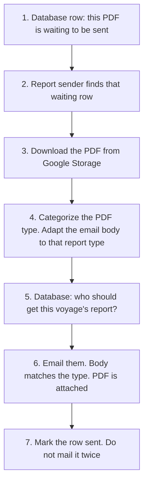

# Report sender — dummy flow chart

Starts at the database. The PDF is already in Google Storage. The sender categorizes the report type, fills the matching email-body template, then mails it.

Written description: [report_sender.txt](report_sender.txt)
